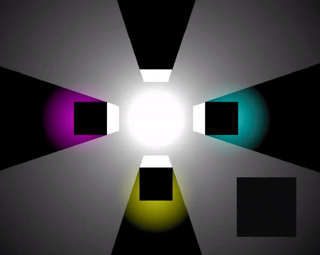

# LightSensor3D plugin for Godot 4

LightSensor3D plugin provides a way to sample environment lighting in 3D scenes. 
This can be useful for stealth games where the player can hide in the shadows. 
Another application might involve tinting 2D UI elements like FPS weapons. 

## Usage
* Drop **LightSensor3D.tscn** in your scene.
* Reserve render layer for the plugins gizmo.
* Disable gizmo render layer on the scene cameras.
* Adjust plugin configuration inside **LightSensor3D.gd**.