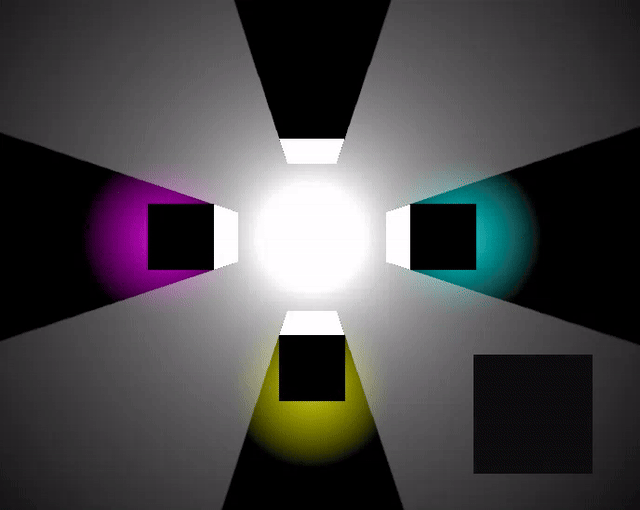

# LightSensor3D plugin for Godot 4
 
LightSensor3D plugin provides a way to sample environment lighting in 3D scenes. 
This can be useful for stealth games where the player can hide in the shadows. 
Another application might involve tinting 2D UI elements like FPS weapons. 

#### [Available in Godot Asset Library](https://godotengine.org/asset-library/asset/4037)

## Usage
* Reserve render layer for the plugins gizmo.
* Disable the render layer on a scene camera to hide the gizmo.
* Use node visibility to activate or deactivate light sensor updates.
* Obtain color **reading** via a script or connect **reading_updated** signal.
* Fine tune configuration inside **LightSensor3D.gd** for a particular project.

## Taking it further
Each light sensor has to use an expensive camera to render the scene! 
This does not scale very well or even guaranteed to be cross-platform. 
There are essentially two development directions that can be taken... 
1. Timer can be added that will activate the sensor for 1 frame. 
Sensor readings can then be interpolated during the waiting time.
2. Sensor can be used to generate a 3D grid, similar to LightmapGI probes. 
Generating such grid inside the editor will require a very complex setup. 

Both approaches will introduce a noticeable update lag. 

